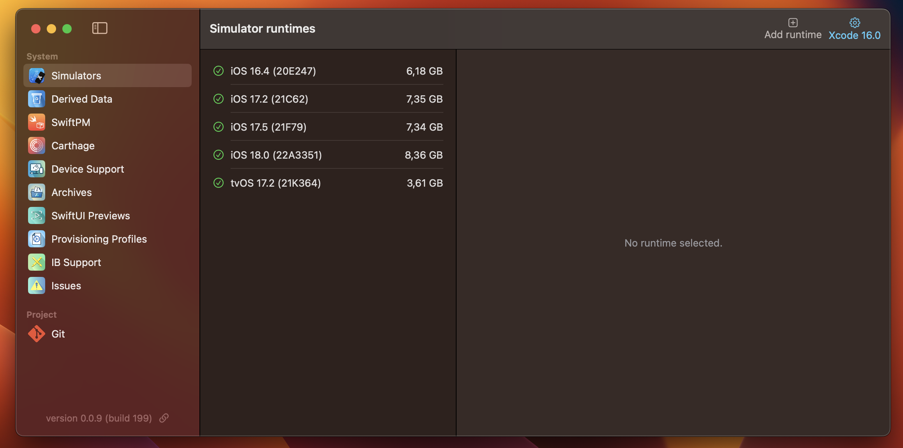

<br/>
<p align="left"></p>

# XDevMan

<p align="center"></p>

There are following functionalities available:

### Xcode Simulators

Helps to manage Xcode Simulators.

- List of available runtimes
- Delete a runtime
- List of simulators per a runtime
- Create new Simulator for given runtime
- Launch and shutdown a simulator
- Recreate a simulator
- View how much a simulator takes disk space
- Find broken simulators

<details>
  <summary>Preview</summary>
  <p align="center"></p>
</details>

### Derived Data

Helps to manage Xcode + [AppCode](https://www.jetbrains.com/objc/) + [Fleet](https://www.jetbrains.com/fleet/) derived data directories.

- View how much disk space taken by derived data per an application
- Delete derived data per an application

<details>
  <summary>Preview</summary>
  <p align="center"></p>
</details>

### Swift Package Manager (SwiftPM)

Manages [SwiftPM](https://www.swift.org/documentation/package-manager/) cached dependencies at */Library/Caches/org.swift.swiftpm/* directory.

- View the dependencies in local SwiftPM cache
- View a disk space consumption of every dependency
- Open a dependency source web page (GitHub)
- Delete a dependency from the cache

<details>
  <summary>Preview</summary>
  <p align="center"></p>
</details>

### Carthage

Manages [Carthage](https://github.com/Carthage/Carthage) cached dependencies at */Library/Caches/org.carthage.CarthageKit/* directory.

- View the dependencies in local Carthage cache
- View a disk space consumption of every dependency
- Open a dependency source web page (GitHub)
- Delete a dependency from the cache
- Manage a dependency's derived data

<details>
  <summary>Preview</summary>
  <p align="center"></p>
</details>

### Apple Device Support

When you connect a real Apple device to macOS (iPhone, Apple watch, Apple TV, etc.) the system copies symbols from it to */Library/Developer/Xcode/iOS DeviceSupport* directory.

- View a list of Apple devices the symbols copied from
- View a disk space consumption for every device symbols
- Delete the symbols for given device

<details>
  <summary>Preview</summary>
  <p align="center"></p>
</details>

### Xcode Archives

When you do `archive` action to Xcode (`Product` menu) it places a built archive at */Library/Developer/Xcode/Archives/* directory.

- View a list of all archives
- View detailed info for an archive
- Delete an archive

<details>
  <summary>Preview</summary>
  <p align="center"></p>
</details>

### Provisioning Profiles

Manages the provision profiles from */Library/MobileDevice/Provisioning Profiles* directory.

- List of all provisioning profiles
- Detailed info about a provisioning profile
- Delete a provisioning profile

<details>
  <summary>Preview</summary>
  <p align="center"></p>
</details>

### SwiftUI Previews

When you use a SwiftUI Preview Xcode feature then Xcode creates a separate Simulator for previewing at */Library/Developer/Xcode/UserData/Previews/Simulator Devices* directory.

- List of all simulators for SwiftUI Preview
- View how much disk space taken by a simulator
- Delete a simulator

<details>
  <summary>Preview</summary>
  <p align="center"></p>
</details>

### Interface Builder (IB) Support

I'm not sure about this. Something creates the simulators at */Library/Developer/Xcode/UserData/IB Support/Simulator Devices* directory.

- List of simulators
- Delete a simulator

<details>
  <summary>Preview</summary>
  <p align="center"></p>
</details>

### Other Issues

Tries to find the issues for Xcode development tools.

- Find broken Xcode simulators
- Find missed/unused/strange simulators logs
- Find dyld cache for deleted simulators

<details>
  <summary>Preview</summary>
  <p align="center"></p>
</details>

### Git

The simplest manager for git project.

- View local branches names
- Delete a local branch

<details>
  <summary>Preview</summary>
  <p align="center"></p>
</details>

## Installation

- macOS Sonoma (14.5+)
- Xcode Command Line Tools (required)

### From Release section

- Download latest release
- Unzip the release archive
- Move `XDevMan.app` to */Applications/* folder
- Launch `XDevMan.app` application
- If the app cannot be launched because of signature of untrusted developer, then do the next step
- Allow the system to run the application from not trusted developer

```bash
xattr -d com.apple.quarantine XDevMan.app
```

### Build from sources (Xcode 16+)

- Download this repository
- Open `Terminal.app`
- Go to the repository sources in `Terminal.app`

```bash
cd ~/Downloads/xdevman/
```

- Build the project by running the commands below in `Terminal.app`

```bash
./make_release.sh
```

- Find `XDevMan.app.${arch}.zip` under hidden folder ./.build
- Unzip the built archive
- Move the app to */Applications/* directory.
- Launch `XDevMan.app` application

## Todo

- [ ] Cocoapods cache
- [ ] Simulators app manager (apps list, user defaults)
- [ ] [Fastlane](https://fastlane.tools) runner in `Terminal.app` (lanes from fastlane/Readme.md)
- [ ] [Scipio](https://github.com/giginet/Scipio) tool to convert `resolved.json` to `Package.swift`
- [ ] [SwiftPM](https://www.swift.org/documentation/package-manager/) show dependencies graph as `Podfile.lock`
- [ ] `Finder` like menu to view files and folders sizes
- [ ] A separate floating window for app's logs
- [ ] `ipa` analyzer (drag and drop)
- [ ] `*.app` analyzer (drag and drop)
- [ ] `*.mobileprovision` analyzer (drag and drop)
- [ ] Unit tests for view's logic
- [ ] Unit tests for services
- [ ] Get rid of `mocks` in `Release` build
